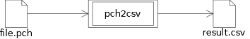
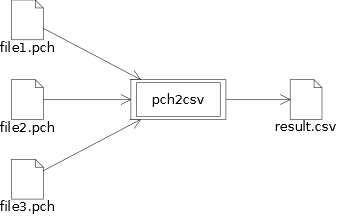
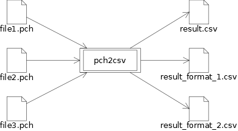

# Nastran Punch Reader (pch2csv)

## Description

A simple tool to convert Nastran Punch output to CSV.

It is written in C++ and uses the standard library.

## Features

The tool reads a Nastran Punch file (`*.pch`) and converts its scary format to
Comma-Separated Format (`*.csv`) readable by Calc or Excel.

Basically, it converts this:

    $TITLE   = MY FEA MODEL                                                        1
    $SUBTITLE=MY FIRST LOAD CASE                                                   2
    $LABEL   =MY FIRST LOAD CASE                                                   3
    $ELEMENT STRESSES                                                              4
    $REAL OUTPUT                                                                   5
    $SUBCASE ID =         666                                                      6
         12345          80004230        BAR                                        7
    -CONT-                  2.288704E+04     -3.404367E+03      1.639255E+03       8
    -CONT-                 -7.163730E+04      9.975631E+05      3.060709E+06       9
         12345          80004231        BAR                                       10
    -CONT-                 -2.301775E+04     -3.107557E+03      4.195733E+02      11
    -CONT-                  7.232352E+04     -9.979151E+05     -3.062225E+06      12

to this:

    "TITLE","SUBTITLE","LABEL","SUBCASE ID",unknown,unknown,unknown,unknown,unknown,unknown,unknown,unknown,unknown,unknown,
    "MY FEA MODEL","MY FIRST LOAD CASE","MY FIRST LOAD CASE","666",12345,80004230,BAR,,2.288704E+04,-3.404367E+03,1.639255E+03,-7.163730E+04,9.975631E+05,3.060709E+06,
    "MY FEA MODEL","MY FIRST LOAD CASE","MY FIRST LOAD CASE","666",12345,80004231,BAR,,-2.301775E+04,-3.107557E+03,4.195733E+02,7.232352E+04,-9.979151E+05,-3.062225E+06,

__Remark:__

The **NASTRAN solver** produces PUNCH file as a result of FEA (Finite Element Analysis)
if the `PUNCH` keyword replaces the default `PRINT` or `PLOT` in the output choices of
the FE model's `CASE CONTROL` section.

For instance, if we want the displacement result as PUNCH file, we add
`DISPLACEMENT(SORT1,PUNCH,REAL)=ALL` to the FE model's `CASE CONTROL` section.

Punch are sometimes more 'readable' than the F06 (`PRINT`'s default format).

__Remark 2:__

Punch formats aren't that bad, however since several types of elements
(with different format!) can be stored inside (and also totals!),
it can be tricky to convert them in a single table.

The work-around found here is to output as many CSV as element / totals types there are.
It's not ideal but this allows a certain 'cleaning' of the data.

In such case, the command:

    $ ./pch2csv input.pch -o output.csv
    Warning: pch2csv detected 4 different formats in 'input.pch'.
    Then, 4 files are produced.

will produce these files:

    output.csv
    output_format_1.csv
    output_format_2.csv
    output_format_3.csv

Note that the tool **warns** when it meets the issue.
This feature can be disabled with `-u`.

## Under the hood

### Simple case

The simplest case is given below.
We have one Punch, containing one format.
That gives a simple output file.

### Concatenate the punch files in an unique output

If several files are proceeded, the tool concatenates them in an unique output file.
This does too, if the `-u` flag is set.

### Split formats in separated files

If the `-u` flag is **not** set, the tool might output several files,
one per format found in the punch file(s).

## Build

1. Download `pch2csv.tar.gz`.

2. Unzip:

        $ tar zxvf pch2csv.tar.gz
        $ cd pch2csv/

3. Build with CMake

     - On Unix / Mac OS X

            $ mkdir -p build
            $ cd build/
            $ cmake ..
            $ make -j4
            $ make install

     - On Windows (MinGW)

            > mkdir -p build
            > cd build/
            > cmake .. -G "MinGW Makefiles"
            > make -j4

     - On Windows (MSVC)

            > mkdir -p build
            > cd build/
            > cmake .. -G "Visual Studio 14 2015"
            > start .

         Then, double click the Visual Studio project (vcxproj).

## Usage

On Unix / Mac OS X

    $ ./pch2csv input.pch -o output.csv

On Windows

    > pch2csv.exe input.pch -o output.csv

__Remarks:__

 - If already existing, the output file **isn't** overwritten.
   Instead, the tool creates a backup of the file with an incremental filename.
 - Additionally, the tool writes the CSV with column titles with option `-c HEADER`.

__Options:__

 - `-h`, `--help`
   Show the help message and exit

 - `-v`, `--version`
   Show the version

 - `-o OUTPUT`, `--output=OUTPUT`
   Specify the name of the output file.
   By default, the output takes the same name as the input, with the `.csv` extension

 - `-c HEADER`, `--column-header=HEADER`
   Specify the csv header content. By default, the column headers are *unknown*.
   `HEADER` must be a sequence of words separated by commas,
   surrounded by a double-quote, for instance: `-c "CBUSH ID,,CS,X in mm,Y [mm],CSout"`

 - `-s`, `--skip-header`
   Do not print the csv header. Data begins at the first line.

 - `-u`, `--unique`
   Force the tool to produce an unique csv, even if several element types / totals
   are detected.

## Similar work from Github's Community

At the time of writing these lines, some interesting things about
Nastran and PUNCH files can be found in Github:

 - The **nastran\_pch\_reader** by anick107, a Python Parser for PUNCH files:
 [https://github.com/anick107/nastran\_pch\_reader](https://github.com/anick107/nastran\_pch\_reader)

 - The **pyNastran** by SteveDoyle2, a Python-based interface tool for Nastran's file formats:
 [https://github.com/SteveDoyle2/pyNastran](https://github.com/SteveDoyle2/pyNastran)
 (especially the pyNastran/bdf/test/unit/test\_read\_write.py)

 - other?

(!) punch files found there are used for testing this tool.

## License

The code is released under the GNU **LGPLv3** open source license.

[https://www.gnu.org/licenses/lgpl-3.0.en.html](https://www.gnu.org/licenses/lgpl-3.0.en.html)
